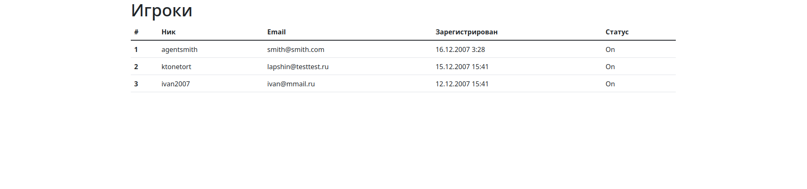

# Тестовое задание на Web-программиста - Targem Games

**Выполнил Дронов Дмитрий**

Запуск:

> Не забудьте настроить подключение к БД в файле `app.config.js`! Некоторые переменные можно задать с помошью файла `.env` (скрыт в гите)

1. `npm install`
2. `npm run export` - для экспорта данных в csv
3. `npm run` - для отображения таблицы (express)

Затем, перейдите на [localhost:8080](http://localhost:8080)

Должна появиться таблица, как на скриншоте:

*Сортировку сделал по времени регистрации в порядке убывания, т.е. первым отображается пользователь, который зарегистрировался позже всех.*

Для того, чтобы очистить данные в БД (чтобы потом повторно проверить экспорт), можно прописать `npm run clean`